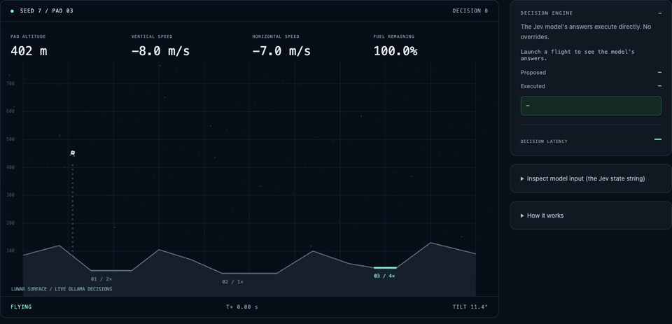

# Lunar Jev

A lunar lander flown, live in your browser, by a Jev-style decision model
running on your own machine through [Ollama](https://ollama.com). Every fifth
of a simulated second the page describes the ship's situation in one sentence,
asks the model two multiple-choice questions (which way to tilt, how much
engine), and applies the answers. No cloud, no framework, no build step: three
static files, a local Ollama, and one stdlib HTTP server.



*An actual flight, recorded from the page in headless Chrome: `jev` pilot
(model alone), `tev1:0.8b`, seed 7, pad 03, played at 4× simulation speed.
670 decisions, every one answered by the local model in about 90 ms, landed
for a score of 200. The right-hand panel is the model's live probability over
each option.*

This is the sibling of [lunar-laya](../lunar-laya), which flies the same
Atari-inspired world with the Laya decision model on Apple MLX from Python.
Here the physics, guidance and prompt are a line-for-line JavaScript port,
and the model call goes to Ollama's new `/v1/systemone` endpoint
([announcement](https://ollama.com/blog/ollama-now-supports-jev-style-decision-models)),
so the whole loop lives in the browser.

## What you need

- **Ollama 0.35 or newer.** The `/v1/systemone` endpoint arrived in 0.35.
  `ollama --version` tells you what you have.
- **A decision model.** `ollama pull tev1:0.8b` (0.8 GB, the one that keeps
  up with real time) or `ollama pull nimble` (9 B parameters, 9.5 GB at its
  default Q8, 5.6 GB as `nimble:9b-q4_K_M`). The page lists whatever installed
  models advertise the `decision` capability and preselects the smallest.
- **Python 3** for the one-line static server, or any other local static
  server you like. Nothing is installed with pip.
- Any modern browser. The page is plain HTML, CSS and JavaScript.

## Quick start

```bash
ollama pull tev1:0.8b
cd lunar-ollama-jev
python3 -m http.server 8765 --bind 127.0.0.1
```

Open **http://127.0.0.1:8765/**, pick a model and a pilot, press **Launch**.
Ctrl+C stops the server.

Why a server at all, when it is just three files? Because of how browsers and
Ollama talk about origins. A page opened from `file://` sends `Origin: null`,
and Ollama's default cross-origin allowlist accepts `localhost` and `127.0.0.1`
addresses but not `null`, so the browser blocks the request before it leaves.
Serving from a loopback port keeps Ollama's default configuration and needs no
`OLLAMA_ORIGINS` tinkering. If you would rather double-click `index.html`,
restart Ollama with `OLLAMA_ORIGINS="*"` and it works from disk too.

If Ollama runs elsewhere on your network, type its address in the **Ollama
host** box; the page remembers it. You will need `OLLAMA_ORIGINS` to include
your page's origin in that case, because the request is no longer local to the
Ollama machine.

## What is on the page

**Controls.** Ollama host, decision model (only models with the `decision`
capability appear), pilot, seed, target pad, playback speed. The seed fixes
the starting position, sideways drift and tilt, so the same seed and pilot
replay the same flight; **Random** rolls a fresh seed for you. The start is
drawn anywhere across the map (x between 100 and 900 m at 450 m up), not near
the chosen pad, so seed and pad are independent: keep the seed and switch
pads to watch the same start fly to three different targets. The scene
previews the chosen start, ship tilt included, as soon as you change the seed
or the pad, so you can see what you are about to fly before pressing Launch.
Speed `max` skips the animation pacing and runs as fast as the model answers,
which is the setting to use when you want numbers rather than a show.

**The scene.** Terrain, the three pads with their score multipliers, the ship
and its trail. Altitude is measured to the selected pad, not to the ground
directly below. Vertical speed is negative when descending. Positive tilt
leans right. A landing counts when the ship touches a pad with sideways speed
at most 2 m/s, descent at most 3 m/s and tilt within 8 degrees.

**Decision engine.** For the most recent decision: the model's probability
over each option and its confidence, the command it proposed, the command
actually flown, whether guidance overrode it, and the round trip time of the
request. Open *Inspect model input* to read the exact sentence the model saw.

**Flight log.** One row per completed flight this session: pilot, model,
outcome, score, how many decisions were overridden, and the median decision
latency. This is where you compare pilots on the same seed.

**Download recording.** The last flight as JSON, in the same `schema_version: 1`
layout lunar-laya writes, so its replay page and builder can read it. Every
frame keeps the state before and after the decision, the prompt, both
commands, the raw answers and the latency.

## How one decision happens

Guidance runs first. It is a small proportional-derivative rule that looks at
where the pad is, how high and how fast the ship is, and produces a desired
tilt and a desired vertical acceleration. Those turn into a requested command
in the model's vocabulary: `left`/`hold`/`right` and `off`/`half`/`full`.

That request and the telemetry become one sentence, identical to the one
lunar-laya builds:

```text
Lunar landing. Requested tilt correction: right. Requested engine power: half.
Altitude 402.0 m. Pad offset 31.2 m. Horizontal velocity -3.1 m/s.
Vertical velocity -8.0 m/s. Tilt -6.0 degrees; desired 12.4.
Desired vertical velocity -12.0 m/s. Fuel 100.0. Positive x is right,
positive y is up, positive tilt is right. Land upright with horizontal
speed <=2 and downward speed <=3 m/s.
```

The page POSTs it to Ollama with two typed questions:

```json
{
  "model": "tev1:0.8b",
  "state": "Lunar landing. Requested tilt correction: right. ...",
  "questions": {
    "rotation": {
      "type": "choice",
      "instructions": "Control lunar lander tilt. Follow the requested tilt correction.",
      "criteria": {"left": "Decrease tilt angle", "hold": "Keep current tilt", "right": "Increase tilt angle"}
    },
    "engine": {
      "type": "choice",
      "instructions": "Control lunar lander engine. Follow the requested engine power.",
      "criteria": {"off": "Zero thrust", "half": "Half thrust", "full": "Full thrust"}
    }
  }
}
```

and Ollama answers both questions in one pass, with no generated text:

```json
{
  "model": "tev1:0.8b",
  "answers": {
    "rotation": {"type": "choice", "choice": "right",
                 "probabilities": {"left": 0.130, "hold": 0.119, "right": 0.751}, "confidence": 0.332},
    "engine":   {"type": "choice", "choice": "half",
                 "probabilities": {"off": 0.001, "half": 0.999, "full": 0.001}, "confidence": 0.989}
  },
  "usage": {"input_tokens": 640, "output_tokens": 3}
}
```

The chosen options map back to a turn of -1/0/1 and a throttle of 0/0.5/1,
the physics integrates ten 0.02 s steps, and the loop repeats. Fuel is shared
between the main engine and the attitude jets, and an empty tank leaves the
ship coasting.

One detail keeps 1× playback honest: the page sends the *next* request as
soon as the physics for the current stage is done, and animates the current
stage while it waits. A decision that comes back in under 200 ms costs no
wall-clock time at 1×. Slower answers stretch the stage; the latency panel
shows what you are paying.

## Three pilots

| Pilot | What flies the ship | What a landing tells you |
|---|---|---|
| `baseline` | Guidance only, no model call | The physics and guidance work; a reference trajectory |
| `jev` | The model's answers, directly | The model can read the sentence and follow the request on its own |
| `assisted` | The model's answers unless they disagree with guidance | How often the model needed to be corrected, in the *Overrides* column |

The sentence contains the requested command, so a model that lands is
demonstrating request following, not that it discovered how to fly. That is
the same framing lunar-laya uses, and it is the honest one. The interesting
number is the disagreement rate in `assisted` mode, and whether `jev` mode
lands at all.

## Measured on this machine

Pad 02, speed `max`, headless through `sim.js` with nothing else asking
Ollama. MacBook Pro M4 Max, Ollama 0.35.0.

| Model | Pilot | Flights | Landed | Overrides | P50 decision | P95 decision |
|---|---|---|---|---|---|---|
| tev1:0.8b | jev | seeds 0–4 | 5/5 | not applicable | 110 ms | 166 ms |
| tev1:0.8b | assisted | seeds 0–4 | 5/5 | 0 of 1880 | 97 ms | 105 ms |
| nimble:9b-q8_0 | jev | seeds 0–1 | 2/2 | not measured | not measured | |
| nimble:9b-q4_K_M | jev | seed 0 | 1/1 | not applicable | 743 ms | |

The small model follows the requested command on every one of 1880
decisions, so its `jev` and `assisted` flights are the same trajectory as the
guidance baseline. Nimble also lands, and takes a slightly different path
(379 decisions on seed 0 against the baseline's 382), so it disagrees with
guidance somewhere and recovers; measuring how often would need the
`assisted` runs that were cut short.

They were cut short because nimble is not a real-time pilot on this machine.
Each decision sends a fresh 640-token state, and a 9 B model pays full prompt
processing for it every 0.2 simulated seconds. Ollama's prompt cache does not
help, since the sentence changes at the start. Quantization does not help
either: `q4_K_M` and `q8_0` both land near 0.7 s per decision, which says the
cost is compute on the prompt, not weight bandwidth. The blog's 91 ms figure
is a shorter prompt on a faster machine. If you want nimble at 1×, shorten the
sentence; if you want the sentence lunar-laya uses, fly tev1.

A handful of seeds on one pad is a smoke test, not a statistic. The seeds
here are not lunar-laya's Python seeds, and the table above was measured
before the start was widened from near-pad to map-wide, so rerun `check.cjs`
or a few flights if you want current numbers. Compare within this project only.
Latency is the round trip as the client sees it, JSON parsing included.

## Checks

```bash
node --check sim.js && node --check app.js
node check.cjs
```

`check.cjs` does three things and says which it skipped:

1. Flies the baseline on 30 seed/pad combinations and expects 30 landings.
2. If `../lunar-laya` is checked out beside this folder, starts the Python
   original from the same state, flies both baselines, and requires every
   prompt string and every state to match (to 1e-9). This is the proof that
   the port is faithful; it needs only Python 3 and the sibling's stdlib code,
   not MLX.
3. If Ollama is reachable, flies one assisted flight with the smallest
   installed decision model and checks that probabilities sum to one and the
   ship lands. Set `JEV_MODEL=nimble` to pick a different one.

## Files

```text
index.html   page layout and the in-page "How it works" note
styles.css   dark mission-control theme, trimmed from lunar-laya's SPA
sim.js       physics, guidance, prompt, the /v1/systemone client, decide()
app.js       controls, flight loop, canvas drawing, flight log, download
check.cjs    the checks above
```

`sim.js` is the only file the browser and Node both load; it exports through
`module.exports` when one exists and is otherwise a plain script.

## Relationship to the other lunar projects

- **lunar-laya** is the origin of the physics, the guidance rule, the prompt
  and the two questions. They were ported rather than copied so nothing here
  needs Python at run time; `check.cjs` keeps them in step. One deliberate
  difference: lunar-laya starts within 100 m of the target pad, this page
  starts anywhere over the map. The guidance rule still lands the baseline
  from all 90 seed/pad combinations tried (seeds 0–29, three pads).
- **lunar-mpc-laya** replaces the guidance hint with a model-predictive
  controller and adds an engine fault. None of that is here; the guidance is
  the simple PD rule and the engine is healthy.
- The lander drawing is the same chamfered box the other three projects use,
  byte for byte, so the ship looks the same everywhere.

## Limits

Synthetic arcade physics, not spacecraft flight software. The prompt hands
the model a requested command, so landings show request following. The
decision models were not fine-tuned on this task; they are the stock Ollama
pulls. No sensor noise, delays, engine faults or wind. The page runs one
flight at a time and keeps its log only until you reload.
